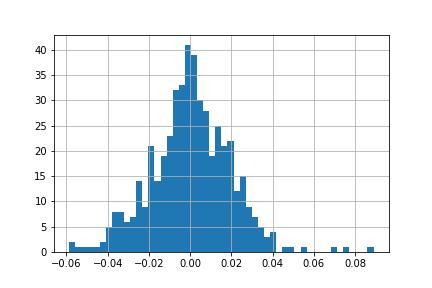
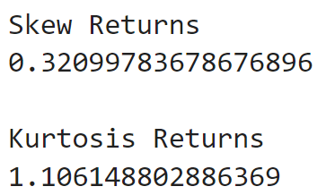
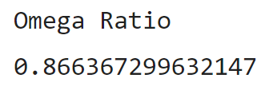

# Omega Ratio
Capture your tail risk with the popular risk-return metric to measure performance: **the Omega ratio.**

https://en.wikipedia.org/wiki/Omega_ratio

The Omega ratio is a weighted ratio of gains and losses above a threshold return. It captures more information about returns than similar metrics like the Sharpe ratio.

It does this by adding up the area under the distribution around the threshold return. The area above the threshold measures the weight of the gains. The area below the threshold measures the weight of the losses. The Omega ratio is the positive area divided by the negative area.

**Without considering the Omega ratio, you miss important information about risk.**

Sophisticated investors like hedge funds use the Omega ratio. They use it because alternative investments have long-tail risks not measured by other metrics like the Sharpe ratio. Even if you’re not investing in exotic derivatives, the Omega ratio is useful.

A simple test shows us AAPL’s returns are not normally distributed.

Capture your tail risk with the Omega ratio
The skew (which measures symmetry) is -0.01. A normal distribution has skew of 0. The kurtosis (which measures outliers) is 5.3. A normal distribution has kurtosis of 3.

Using performance metrics that don’t take the entire distribution into consideration misses important information about risk. Use the Omega ratio to capture it.

Key Takeaways:

- Get stock price data
- Compute the Omega ratio
- Assess AAPL with the Omega ratio

---

Import the required libraries.

yfinance 
numpy
matplotlib

---

**File:** [Omega Ratio](omegaRatio.ipynb)

---

## Step 1: Get the data

Use the yFinance library to get data

For this example we will work with the AAPL adjusted closing price using the built in pct_change() function

---

## Step 2: Compute the Omega ratio

https://en.wikipedia.org/wiki/Omega_ratio       for more details.

Create a function for the Omega ratio

- Annualize the return threshold. 
    (The ** syntax is the power operator i.e. 2**2 is 2 squared.)
- Subtract the threshold from the returns.
- Add up the positive returns less the threshold and negative returns less the threshold.

The Omega ratio is the sum of positive returns less the threshold divided by the sum of negative returns less the threshold.

---

## Step 3: Use the Omega ratio
When analyzing a stock, investment returns, or strategy performance, start with the return distribution. If the returns have skew and kurtosis, consider using the Omega ratio.

Going back to the AAPL example, create a distribution of returns

**You can check the skew and kurtosis.**

---

### Compute the Omega ratio.

Use a threshold of 7% which is the historical average annual return of the stock market. 

The Omega ratio is 0.87. Taking into consideration skew and kurtosis, AAPL’s gains outperformed the losses by a factor of 0.87.

---

*Since asset returns are not normally distributed, use the Omega ratio to capture risks other metrics don’t.*
